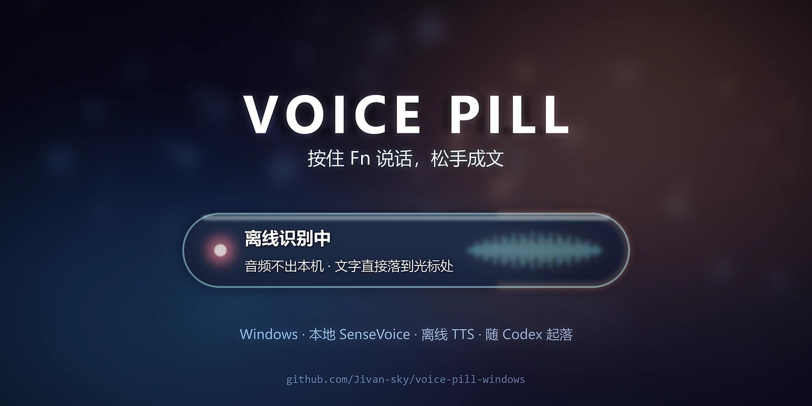

# voice-pill-windows



Voice Pill 的 Windows 移植工程。按住热键说话，松手把文字粘到光标处。

## 一句话思路

**内核照搬，外壳重写。** ASR 引擎是独立 CLI 子进程（stdin 灌裸 PCM / stdout 出 NDJSON），跨平台可交叉编译；macOS 专属的采音、热键、粘贴、悬浮窗全部重做。

## 当前状态

| 阶段 | 状态 |
|---|---|
| 原版架构拆解 | ✅ 完成 |
| 可行性评估 | ✅ 完成 |
| 路线选型 | ✅ **B**（Python 轻量壳） |
| 主键定案 | ✅ **Fn** —— 实测本机 Fn 上报为 `E0 63` / vk `0xFF`，按下松开成对 |
| 工具链（M0） | ✅ **完成** —— Go 1.27.0 · cargo 1.99.0 · gcc 16.2.0 · libopus · rustup gnu target |
| Python 依赖 | ✅ venv `.venv` + sounddevice / numpy / scipy / sherpa-onnx |
| 外壳代码 | ✅ 8 个文件写完，`py_compile` 通过，`--check` 端到端跑通 |
| 引擎编译（M2） | ✅ **完成** —— `codex-asr.exe` 10 653 552 B · `freeasr.exe` 24 963 013 B（静态，只依赖系统 DLL） |
| 热键链路 | ✅ **验证通过** —— 进程在 `WinSta0\Default`、钩子+消息泵自激自收正常、物理按键实测收到 134 条 |
| 通路验证（M1） | ✅ **完成（2026-10-02）** —— Fn → 采音 → NDJSON 管道 → 解码 → 粘贴，四段逐段验过，假引擎全链路一次通过（`EXIT CODE 0`） |
| 本地后端（M2.5） | ✅ **完成（2026-10-03）** —— `local` 跑 SenseVoice-Small int8，RTF 0.027，`pipe-selftest` 全链路通过，实时字幕保住。见 `docs/移植方案.md` 6.5 |
| 发声（2026-10-03） | ✅ **完成** —— 离线神经 TTS，让它回话也能听见。Kokoro 多语言 v1.1（103 音色）落在本机模型目录，与 ASR 模型并排；懒加载、整段一条输出流 + 合成预取一句、按 Fn 立刻打断。**默认按需**（`speak_replies=false`），走控制面 `speak`/`shutup`、MCP 工具、或回合结束 `Stop` 钩子。不联网、不需要账号。见 `docs/移植方案.md` 第 16 节 |
| 远端后端 | ❌ **两条都不可用** —— Codex 要 ChatGPT 付费令牌；豆包非官方协议 2026-10-03 复查确认服务端已不路由（凭据与握手都正常，服务端自己回 `service discovery failure`）。代码保留，改 `settings.json` 一行可切回。见 6.4 / 6.5 |
| 真麦克风验收 | ✅ **通过（2026-10-03）** —— 真按 Fn 录 6.79 秒 → 解码 0.19 秒 → 粘贴成功，**用户确认「很准」** |
| 常驻形态（M5 提前） | ✅ **完成（2026-10-03）** —— 单实例锁、无窗口常驻、**随 Codex 起落**（开 Codex 自动拉起、关 Codex 自动收摊）、崩溃自拉、120 秒录音护栏、日志与留存清理、配置热重载、`--stop`。开机自启是**可选**项，默认不装（2026-10-04 改，见下）。见 `docs/移植方案.md` 第 11、17 节 |
| 控制面（2026-10-03） | ✅ **完成** —— 命名管道 + authkey，七个命令（`status`/`start`/`stop`/`cancel`/`take`/`speak`/`shutup`）。让外部进程（Codex 插件）能问状态、驱动录音、取走文字。见 `docs/移植方案.md` 第 12 节 |
| 控制面加固（2026-10-03） | ✅ **完成** —— 发声自测踩出两个真 bug 并修掉：管道名原本全机共用（另一个用户、或密钥重建后的客户端能把控制面**永久打死**），客户端握手原本没有超时（会**永不返回**）。现在管道名按用户派生、建连 3 秒上限、服务端不被坏连接带走；`tools/bridge-selftest.py` 20 项专盯坏输入。见 `docs/移植方案.md` 12.5 |
| 交付护栏（2026-10-03） | ✅ **完成** —— 对照上游 0.2.4：粘贴卡死 8 秒自动解锁；非 `PasteError` 异常不再静默锁死 Fn；代际令牌保证迟到的旧交付不碰新会话。见 `docs/移植方案.md` 第 14 节 |
| Codex 插件（2026-10-03） | ✅ **完成** —— 按 Fn 说的字注入当轮对话；八个 MCP 工具。插件源码在 `plugins/voice-pill/`，一键装：`plugins/install.py`。见 `docs/移植方案.md` 第 13 节 |
| persona（2026-10-03） | ✅ **完成** —— 不另造人设：照 ANC（`HA7CH/ai-native-company`）的七段式 schema 写在 `plugins/voice-pill/persona.md`，`SKILL.md` 只引用不复述，`tools/persona-selftest.py` 16 项把关。见 `docs/移植方案.md` 第 15 节 |
| 与 Codex 共同启停（2026-10-03） | ✅ **完成** —— 开 Codex 自动拉起（`SessionStart` 钩子，幂等），关 Codex 自动收摊（看门狗照 `anchor.json` 盯住**最外层**那个 Codex 进程，人一没就走 `--stop` 优雅路径）。**认人不认号**：句柄钉住内核里的进程对象，PID 被复用也不会认错；纸条读不到就退回常驻，绝不因为绑不上就不干活。`tools/supervise-selftest.py` 47 项把关。见 `docs/移植方案.md` 第 17 节 |
| 口述落库（2026-10-03） | ✅ **完成** —— 两条触发：**双击 Fn** 给下一次口述打标记（HUD 提示；不经过 ASR，所以口令被听歪也不影响），或按 Fn 说「记一下：…」。松手后不粘贴，而是落成 Obsidian `00_Inbox/` 下的一篇捕获笔记（带 `type/inbox`）。判定与写盘是纯函数，可脱离窗口单测；目标目录写在 `settings.json`，仓库里不存机器路径。见 `docs/移植方案.md` 第 18 节 |
| 插件换 Go 单 exe（2026-10-03） | ✅ **完成** —— 插件侧交付物从「plugin venv + 8 个 Python 文件」换成一个 `voicepill.exe`（8 个 MCP 工具 + 3 个钩子入口）；控制面新增一条语言无关的 NDJSON 通道，旧的 `multiprocessing` 通道原样保留。**实测（同一台机器，各 5 次取中位数）**：`initialize` 往返 Python 版 **2345 ms** → Go 版 **42 ms**（约 56×）；复跑办法 `tools/pluginexe-selftest.py --timing`，只报数不判失败。见 `docs/移植方案.md` 第 19–22 节 |

**M1 验收记录（2026-10-02）**

| 环节 | 证据 | 结论 |
|---|---|---|
| 采音 | `ACT stop held=1.95s bytes=64728 wav=64772`（64728+44=64772 自洽） | ✅ 录音落盘字节数对得上 |
| 管道 | `pipe-selftest` 回放 127 224 B / 2.65 s | ✅ 背压、解码、超时、退出码全走通 |
| 粘贴 | `paste-selftest` 文字落入靶子文本框，剪贴板已还原 | ✅ 真 `paste.paste()` 生效 |
| 全链路 | `main.py --once`（假引擎）一次录音后 `EXIT CODE 0` | ✅ 含进程生命周期 |

> **`--once` 跑完不退出？** 踩过一次，进程挂了 3 分钟还占着麦克风（见 `docs/移植方案.md` 5.2）。调试期一律包一层 `timeout`：
> ```bash
> timeout 150 .venv/Scripts/python.exe src/main.py --once
> ```
> 后遗症很隐蔽：僵尸进程握着麦克风时，**新起的实例流能正常打开、不报错，但一帧都收不到**（5.3）。现在 `on_stop()` 里有体检闸门，采到不足 0.10 秒会直接提示"麦克风没出声"，不再把空音频灌给后端。

> **别再误判「0 条事件 = 环境限制」。** 早先几轮自测收到 0 条按键，一度归因于"后台进程看不见输入"。现在已定论：**进程没问题**，是那 60 秒里确实没人按键盘。判据本身缺失，不是环境限制。详见 `docs/移植方案.md` 6.3。
>
> 要测 Fn 这种"得等人来按"的项，用 `tools/fn-watch.py` 长时监听（默认 900 秒，随时按都算数），**别用固定窗口**——实测 60 秒窗口里人往往在往输入框打字，134 行字母键会把要看的 Fn 淹掉。

## 目录

| 路径 | 内容 |
|---|---|
| `src/` | Python 外壳：热键、采音、管道、粘贴、悬浮条、状态机 |
| `src/capture.py` | 口述落库：判定口令、原子写 Inbox（纯函数，不碰 Windows API） |
| `bin/` | 两个 ASR 引擎可执行文件放这里（`codex-asr.exe` / `freeasr.exe`），见 `bin/README.md` |
| `bin/voicepill.exe` | 插件侧单文件可执行程序（8 个 MCP 工具 + 3 个钩子入口），由 `tools/build-plugin-exe.ps1` 产出 |
| `go/voicepill/` | 插件侧 Go 单 exe 源码：一个二进制两种身份（MCP stdio 服务端 + 三个钩子入口） |
| `vendor/` | 两个引擎的上游源码副本（`codex-asr` / `FreeASR`），与上游 macOS 版里的那份一致 |
| `tools/build-engines.sh` | 一键编两个引擎，四个坑都注释在脚本里 |
| `tools/fn-probe.py` | Fn 键探针（Raw Input + 低级钩子双通道），带 `--keyup` / `--only` 开关 |
| `tools/desktop-probe.py` | 排查"收不到键盘"：窗口站/桌面/完整性 + 钩子自激自收 |
| `tools/input-liveness.py` | 判会话里到底有没有物理输入（`GetLastInputInfo`，动鼠标即可，不用按键） |
| `tools/fn-watch.py` | 长时只盯 Fn 的监听（默认 900 秒），输出是给上层读的事件流 |
| `tools/shell-selftest.py` | 热键 + 采音自测，**不需要引擎** |
| `tools/capture-probe.py` | 采音单独验：开流耗时 + 收尾竞态回归 + 空录音闸门 + 对象复用 |
| `tools/pipe-selftest.py` | 拿 WAV 直接喂引擎，跳过麦克风和热键，单独验管道/解码/超时 |
| `tools/paste-selftest.py` | 自建靶子文本框验粘贴（不污染用户正在用的窗口），含剪贴板还原 |
| `tools/resident-selftest.py` | 常驻形态自测：单实例/护栏/清理/日志滚动/`--stop`/热重载，起真进程从外面观察，**不需要人也不需要麦克风** |
| `tools/supervise-selftest.py` | 「和 Codex 共同启停」自测：认人 / 句柄 / 纸条 / 换人 / 收摊 / 兜底，不碰真身 |
| `tools/capture-selftest.py` | 落库判定与原子写盘自测（31 项） |
| `tools/mock-asr.py` | 假引擎（实现 NDJSON 契约），用来单独验管道/解码/粘贴 |
| `tools/local-asr.py` | **本地离线引擎**（sherpa-onnx + SenseVoice），实现同一份 NDJSON 契约，`local` 后端用它 |
| `tools/build-plugin-exe.ps1` | 一键编 `bin/voicepill.exe`（`-trimpath -s -w`，二进制不带本机路径） |
| `tools/pluginexe-selftest.py` | Go exe 端到端自测（61 项）：假引擎 + 真 exe 打八个工具与三个钩子，与冻结的 Python 契约对拍 |
| `tools/install-selftest.py` | 安装自测（16 项）：**装没装上问 Codex 自己**（`codex plugin list`），问不到不许放行；`--check` 的退出码必须与 Codex 的说法一致 |
| `src/console.py` | 控制台编码兜底（管道下打印 ✅ 会 GBK 崩）+ 应用日志 |
| `src/single_instance.py` | 单实例互斥体：两个实例会各采一遍麦克风、各粘一遍 |
| `src/bridge.py` | 控制面：命名管道 + authkey，给外部进程驱动本进程用 |
| `src/anchor.py` | 锚点：沿父链找**最外层**那个 Codex 进程并落成纸条；句柄 + 映像核对，PID 被复用也不认错人 |
| `src/supervise.py` | 看门狗：真身非正常退出时重拉，正常退出则一起退；还照 `anchor.json` 盯住 Codex，它一退就请真身收摊 |
| `src/autostart.py` | 开机自启的安装/卸载/查看（**默认不装**：常驻由「随 Codex 起落」负责，见 `docs/移植方案.md` 第 17 节） |
| `THIRD_PARTY.md` | 第三方组件与许可清单（本仓库内的正本） |
| `docs/移植方案.md` | 路线对比、键位实测记录、里程碑、风险 |
| `plugins/voice-pill/` | Codex 插件源码：技能、`.mcp.json`、三个钩子（`SessionStart` 拉起+绑命 / `UserPromptSubmit` 说话进对话 / `Stop` 回复出声）（**仓库是唯一源码**，靠目录联接出现在 Codex 眼里） |
| `plugins/install.py` | 一键把插件接到本机：建目录联接、放置 exe、渲染模板、`codex plugin add`（不再铺 venv）。`--check` 会**问 Codex 确认装没装**，问不到就报「无法确认」 |

## 快速开始

```bash
# 自检：引擎、麦克风、配置、凭据
.venv\Scripts\python.exe src\main.py --check

# 正常运行
.venv\Scripts\python.exe src\main.py
```

`local`（默认后端）需要模型：把 SenseVoice-Small int8 放到任意目录，再把路径写进
`settings.json` 的 `local_model_dir`（下载方式见 `docs/移植方案.md` 6.5）。
两个远端后端的二进制仍放 `bin/`（见 `bin/README.md`）。

## 常驻运行

**默认形态：随 Codex 起落。** 装好插件后，开 Codex 会自动把它拉起来、关 Codex 会自动收摊——
不需要开机自启，登录后也不会留下空跑的后台进程。见 `docs/移植方案.md` 第 17 节。

只有「不开 Codex 也想按 Fn 说话」时，才需要装开机自启：

```bash
# 装开机自启（本机非管理员注册不了计划任务，会自动落到启动文件夹 + 看门狗）
.venv\Scripts\python.exe src\main.py --install-autostart

# 取消
.venv\Scripts\python.exe src\main.py --uninstall-autostart
```

装完后确认它活着，以及需要停它的时候：

```bash
.venv\Scripts\python.exe src\main.py --check     # 看「[常驻]」一段：在跑没、自启装没、日志多大
.venv\Scripts\python.exe src\main.py --stop      # 让它优雅退出（正在录音会等这次收尾）
```

| 想知道的 | 去哪看 |
|---|---|
| 它还在不在 | `--check` 的「实例」一行；或任务管理器里有没有 pythonw |
| 为什么不动了 | `%LOCALAPPDATA%\VoicePill\logs\app.log`（**启动横幅有、收尾行没有 = 非正常死亡**） |
| 崩过没有 | 同一份 app.log：看门狗会记「子进程退出 code=…」 |
| 改配置 | 直接改 `%LOCALAPPDATA%\VoicePill\settings.json`，**2 秒内热重载**，不用重启 |

**同一时刻只允许一个实例**：两个实例都会采到同一支麦克风、都会粘贴，一次说话会被
粘两遍（实测过）。第二个实例会被直接拒掉（exit code 3），并告诉你怎么停掉前一个。

`settings.json` 里三个新开关：`max_record_seconds`（单次录音上限，默认 120，
0 = 不限）、`retention_minutes`（失败录音与转写日志保留几分钟，默认 3，0 = 不清理；
成功那一次本来就当场删，不看这项）、
`pending_ttl_minutes`（待取文字的保鲜期，默认 30，0 = 不过期）。

## 从别的进程用它（控制面）

驻留进程开了一条本机命名管道，给别的程序问状态、驱动录音、取走刚说的字。
一次连接一条请求，请求与响应各一行 JSON；密钥在
`%LOCALAPPDATA%\VoicePill\bridge.key`，两端自动生成。

```python
import sys; sys.path.insert(0, r"<工程>\src")
import bridge

bridge.call("status")   # {pid, phase, provider, hotkey_alive, pending, ...}
bridge.call("take")     # {texts: [...], count: n} —— 取走并清空
```

七个命令：`status` / `start` / `stop` / `cancel` / `take` / `speak` / `shutup`。`take` 是**取走**语义，
且只返回保鲜期内的字：`pending_ttl_minutes`（默认 30 分钟）之外的旧话直接丢弃，
不会再注入到下一轮对话里。

## 接进 Codex（插件）

插件把这份能力接给 Codex：按 Fn 说的字会作为**本轮附加上下文**注入当轮对话；
Codex 也能反过来问状态、请你录一段、把队列里的字取走。语音引擎仍是本仓库这一个
常驻进程，插件只是控制面客户端（见上一节），**音频不出机器**。

```bash
# 装（可反复跑，缺什么补什么；--check 只看现状）
.venv\Scripts\python.exe plugins\install.py
```

脚本做这几件事：把 `%USERPROFILE%\plugins\voice-pill` 建成指向本仓库
`plugins/voice-pill` 的**目录联接**；把 `bin\voicepill.exe` 摆进插件目录；按模板渲染出
`.mcp.json` 与 `hooks/hooks.json`（机器路径只在这两处，且被 `.gitignore` 挡在仓库外）；
写引擎根纸条 `%LOCALAPPDATA%\VoicePill\engine.json`；`codex plugin add voice-pill@personal`。
**装完要新开一个 Codex 线程**才会拾取。

两条硬约束（实测，别绕）：

- 插件在 Codex 眼里必须住在一个**不含 `&`** 的路径上——本仓库所在的
  `<仓库根>` 带 `&`：命令串不加引号会被 cmd 当分隔符拆断（钩子报
  Failed），加了引号 Codex 只回一句 `Completed`，脚本根本没被执行。所以走目录联接。
- `.mcp.json` 与 `hooks/hooks.json` 里的路径**只能是绝对路径**（插件会被整包拷进
  Codex 自己的 cache，相对路径在那边解析不了）。这两处由 `install.py` 生成。

装好后 Codex 多出八个工具：`voice_pill_status` / `voice_pill_listen` /
`voice_pill_stop` / `voice_pill_cancel` / `voice_pill_take` / `voice_pill_speak` /
`voice_pill_shutup` / `voice_pill_prompt_hook`，外加三个钩子：`SessionStart`
（开 Codex 拉起驻留实例并绑命）、`UserPromptSubmit`（说的话进对话）、`Stop`
（回复出声）。待取文字有保鲜期（`pending_ttl_minutes`，默认 30 分钟）：
更早说的不再注入，也不会留到下一轮。

## 许可

原版为 MIT。移植产物沿用 MIT，保留上游署名与第三方组件许可，清单见本仓库
`THIRD_PARTY.md`（上游 macOS 版也有同名一份）。
